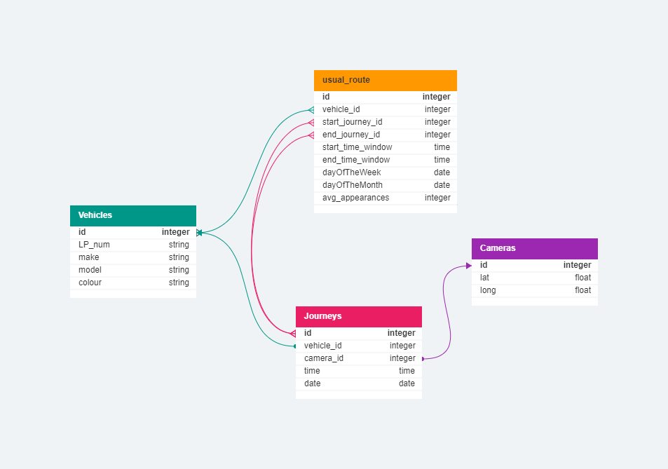
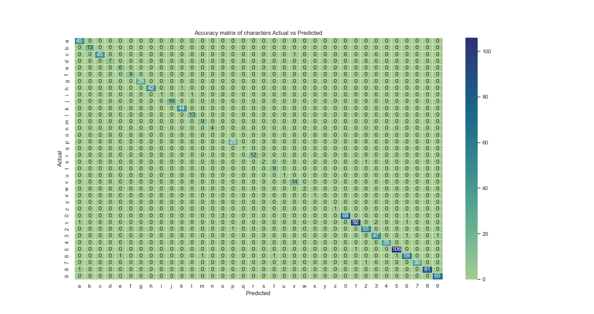
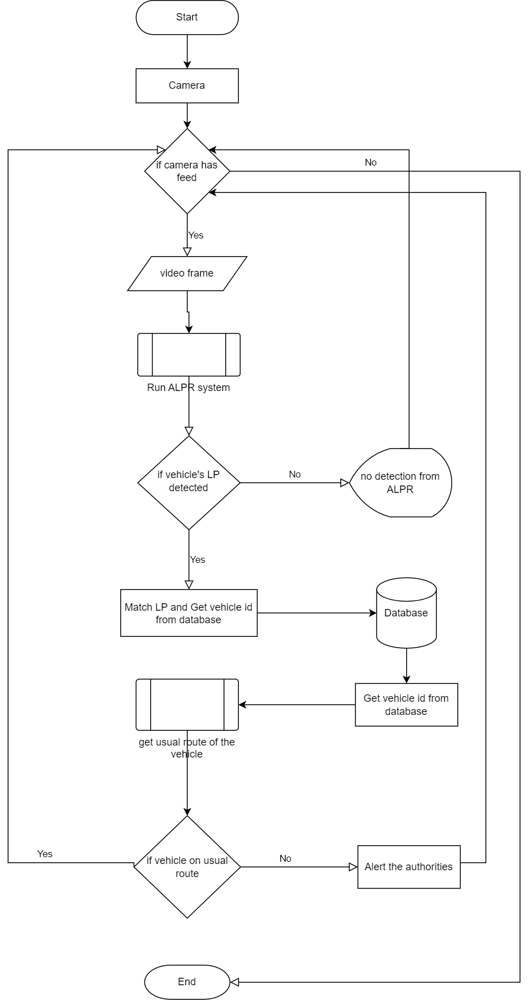

# Thesis-ALPR
Final thesis at University of Bolton, where an ALPR system was evaluated and a theoretical framework was presented for its enhancement in detecting cloned vehicles.
 

An ALPR system is automic license plate recognizer that are commonly used on highways, to detect and maintain discipline by enforcing laws.

The logical framework for database is presented, schema of db:
 

 
 

The confusion matirx inspired character wise evaluation plot:
 

  

 

 
The results of evaluation of different methods for ALPR system:

  

 

 

The flowchart for ALPR enhancement is 
 
 

